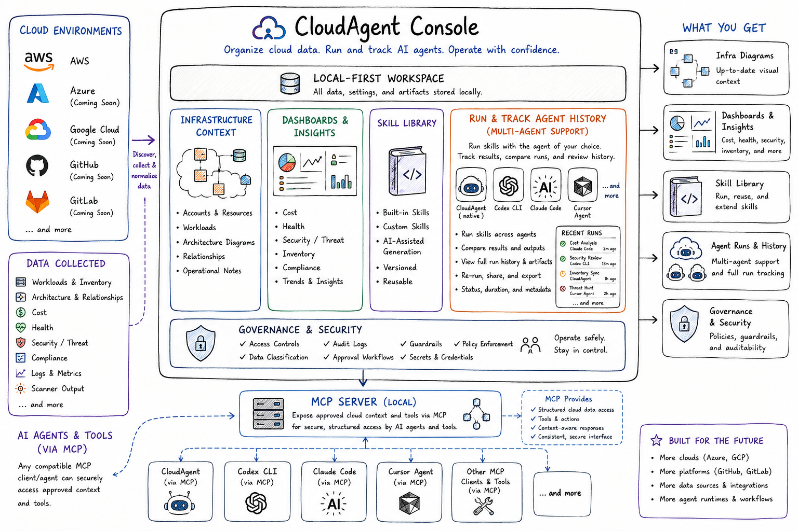
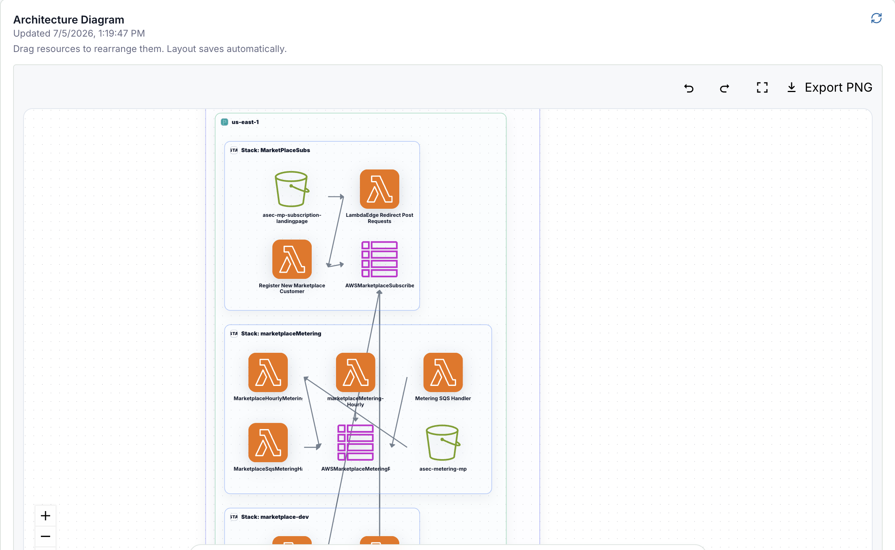
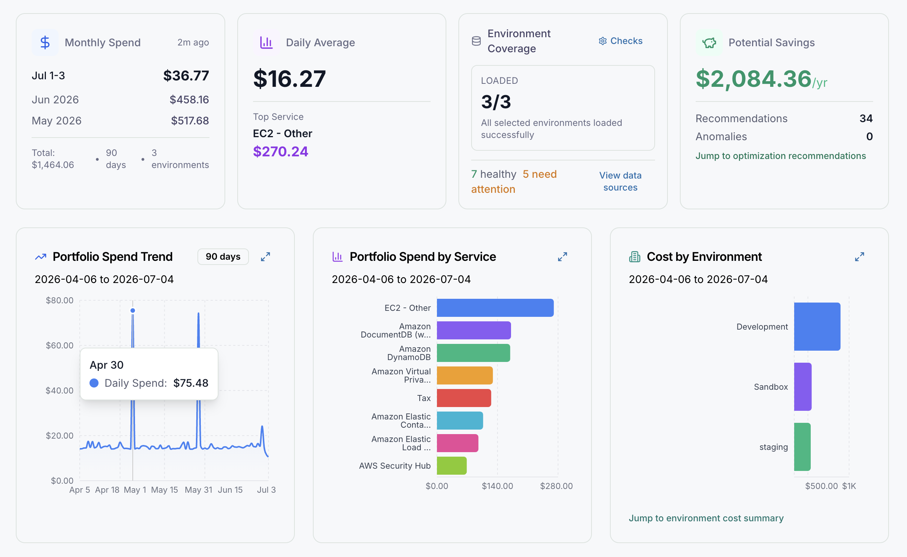
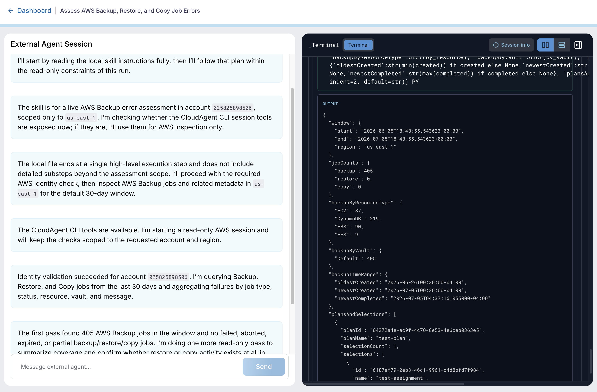
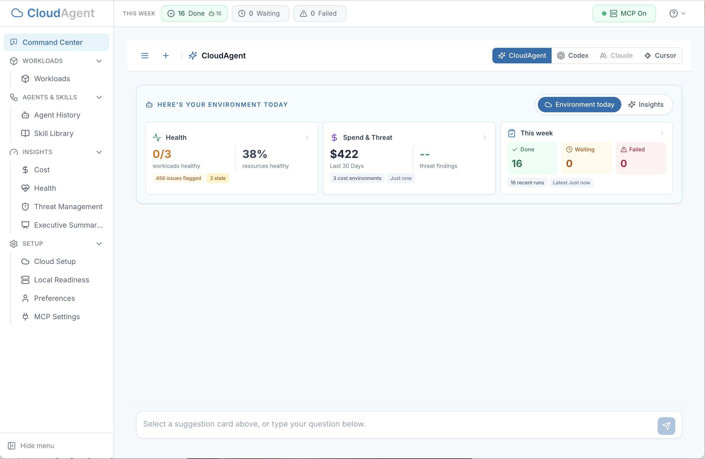

# CloudAgent Console

CloudAgent Console is an open source, local-first desktop console for organizing cloud context and running AI agents against cloud environments.



It helps teams document workloads, centralize cloud data artifacts, generate and run CloudAgent skills, expose approved context through MCP, and use supported local agent runtimes for cloud operations.

CloudAgent Console is designed to make cloud operations easier and safer by organizing the data agents need to reason about cloud environments, while remaining extensible for more data sources, cloud providers, and AI agent runtimes over time.

## What Can You Do?

With CloudAgent Console, you can:

- **Document cloud workloads:** discover accounts and workloads, maintain architecture context, generate diagrams, and keep operational notes close to the cloud resources they describe.


- **Centralize cloud data for agents:** collect cost, health, threat, inventory, scanner, workload, diagram, and agent-run artifacts in one local workspace.
- **Run agents through the desktop UI:** create CloudAgent skills, refine them with AI, run them with supported agents, and keep run artifacts attached to cloud context.
- **Use CloudAgent Console as an MCP context server:** expose approved workload, environment, and cloud data through the local MCP server so compatible agents and tools can access structured cloud context.
- **Investigate cloud signals:** use collected cost, health, threat, inventory, and scanner data to support cloud analysis and operational workflows.


- **Compare agent runtimes:** run skills with the native CloudAgent runner or supported local coding-agent CLIs when they are installed and configured.
- **Build repeatable cloud operations:** create skills and workflows that can evolve into repeatable cloud operations and agent-assisted runbooks.

## Supported Cloud Environments

Current support:

- AWS

Planned support:

- Azure
- Google Cloud
- GitHub
- GitLab

## Supported Agent Runtimes

CloudAgent Console includes the native CloudAgent runner and can hand off skill runs to supported local coding-agent CLIs when they are installed and configured.

Supported runtimes:

- CloudAgent native runner, backed by OpenAI and the OpenAI Agents SDK.
- Codex CLI.
- Cursor Agent.
- Claude Code.



Install optional agent CLIs separately, then set their paths in **Preferences**. CloudAgent Console can run without every optional runtime installed; unavailable tools simply will not be used.

## How It Works

CloudAgent Console can be used in two main ways.

First, you can use the desktop application as the main operating surface. From the UI, you can configure cloud environments, discover accounts and workloads, review dashboards and insights, document architecture context, manage diagrams and notes, create and run CloudAgent skills, configure agent runtimes, and inspect artifacts from agent runs.



Second, you can use CloudAgent Console as a local MCP context server. In this mode, compatible agents and tools running on your system can use the MCP server to access approved cloud environment data in a structured way. This lets external agents retrieve workload context, environment metadata, documentation, diagrams, scanner output, and other cloud artifacts without each agent needing to rediscover or rebuild that context independently.

The desktop console and MCP server both use the same local workspace, so cloud context can be organized once and reused across the UI, CloudAgent skills, and compatible local agent tools.

## Local-First

CloudAgent Console stores preferences, cloud context, workload documentation, diagrams, scanner output, and agent-run artifacts in a local workspace.

Optional integrations can extend where context comes from and which agent runtimes are used, but the core console is designed to run from a local desktop environment.

## Roadmap

Planned areas of work include:

- Repeatable workflows for cloud operations and agent-assisted runbooks.
- Broader Azure and Google Cloud support.
- GitHub and GitLab context integrations.
- More scanner, inventory, cost, health, and threat data sources.
- More flexible MCP and agent-runtime attachment points.
- A hardened packaged installer flow for public desktop downloads.

## Desktop Development Targets

CloudAgent Console currently supports source/development use on:

- macOS
- Windows

Packaging configuration currently targets macOS and Windows. Linux packaging is not a current target.

## Requirements

Required for running CloudAgent Console from source:

- **OpenAI API key** for CloudAgent, skill generation, and AI-assisted analysis.
- **Node.js `20.19.0` or newer** and npm.
- **AWS environment** to onboard if you want account discovery, scans, workload documentation, and cloud insights.
- **AWS CLI** installed and configured if you want to use AWS discovery and related cloud operations.

## Install And Getting Started

### Install From Source

CloudAgent Console does not yet provide a hardened public desktop installer. For now, run it from a checked-out source repository.

For a checked-out copy of the repository, run the local setup script from the repository root:

```bash
npm run setup:local
```

The setup script installs npm dependencies, builds the desktop UI, and starts the local Electron app. It is a source-checkout bootstrap script, not the final downloadable desktop installer.

To install dependencies without launching the app:

```bash
npm run setup:local -- --no-launch
```

To start the app without reinstalling dependencies:

```bash
npm run setup:local -- --skip-install
```

After setup, you can also start the built local app directly with:

```bash
npm run electron:local:build
```

### First-Run Setup

1. Open **Preferences**.
2. Add your OpenAI provider key and model.
3. Confirm the local data directory.
4. Enable or disable the local MCP server.
5. Configure optional CLI paths for AWS CLI, Codex CLI, Cursor Agent, and Claude Code.
6. Open **Cloud Setup** and add an AWS environment.
7. Run account discovery to inventory accounts and discover workloads.

CloudAgent Console persists these settings locally. Environment variables are developer overrides, not required setup.

### Onboard An AWS Account

1. Confirm your AWS CLI profile works outside CloudAgent Console.
2. Open **Cloud Setup**.
3. Add the AWS account or organization details.
4. Run discovery.
5. Review discovered accounts and workloads under **Workloads**.

## Project Status

CloudAgent Console is early-stage open source software. Current development focuses on AWS support, local cloud context management, skill execution, MCP integration, and desktop packaging.

APIs, data models, and workflows may change as the project evolves.

## How To Contribute

Useful contributions include:

- Bug reports with clear reproduction steps.
- Documentation improvements for setup, cloud onboarding, MCP, skills, dashboards, and workflows.
- New cloud data sources, scanner integrations, or agent-runtime integrations.
- Focused pull requests that keep changes scoped to one feature or fix.

Before opening a pull request, run the relevant local checks for the area you changed. For UI or desktop changes, start with:

```bash
npm --workspace @cloudagent/desktop-ui run build
```

## More Documentation

- [Desktop app architecture and packaging](cloudagent-desktop/README.md)
- [MCP server and tools](core/mcp/README.md)
- [Skills: building, creating, and managing skills](core/skills/README.md)
- [Managing cloud environments and workloads](core/workloads/README.md)
- [Dashboards and insights: cost, health, and threat](cloudagent-desktop/apps/ui/README.md)
- [Scanners and data collection](core/scanners/README.md)
- [Supported agent runtimes](core/agent-runtime/README.md)
- [CloudAgent orchestration](core/cloudagent/README.md)
- [Workflows](core/workflows/README.md)